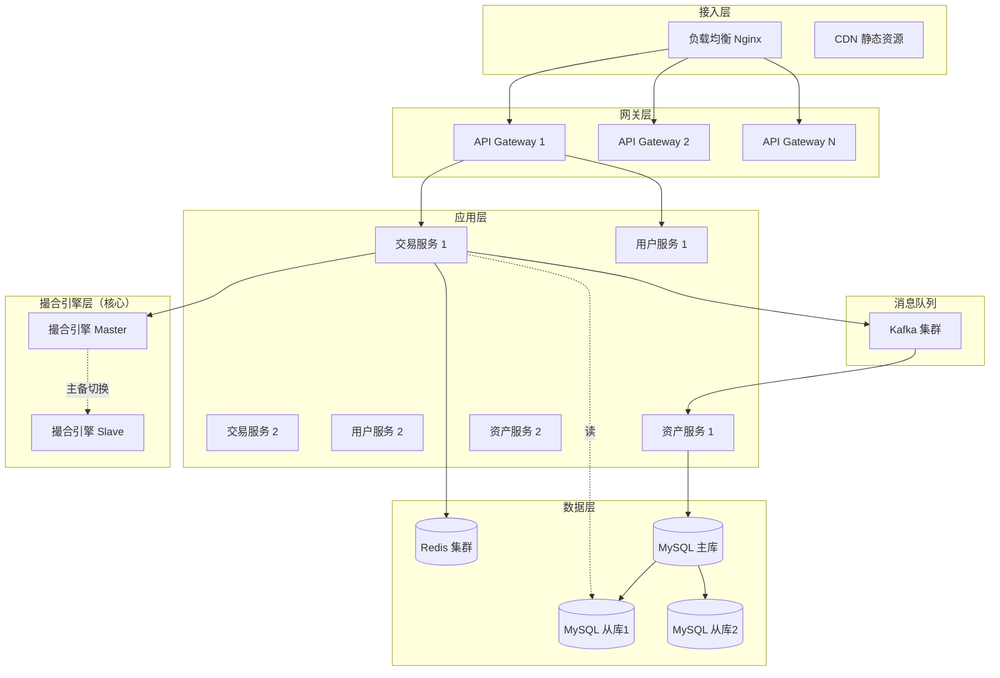

# 交易所高并发架构设计方案

## 一、当前系统瓶颈分析

### 🔴 核心瓶颈

| 模块 | 当前实现 | 瓶颈 | TPS 上限 |
|------|---------|------|---------|
| 撮合引擎 | 单机内存 | 单点故障，无法横向扩展 | ~1000 |
| 数据库 | MySQL 单库 | 读写压力集中，锁竞争 | ~500 |
| WebSocket | 单进程 | 连接数受限，广播慢 | ~10000 连接 |
| API 网关 | 无限流 | 恶意请求可压垮系统 | 无限制 |

### 目标性能指标

- **撮合引擎**: 10万 TPS（每秒处理订单数）
- **API 吞吐**: 20万 QPS
- **WebSocket**: 100万+ 并发连接
- **延迟**: P99 < 100ms

---

## 二、高并发架构设计

### 整体架构图



---

## 三、核心模块优化方案

### 1. 撮合引擎（最关键）

#### 🎯 单机性能优化

**内存数据结构优化**:
```go
// 当前: 使用 container/heap（需要堆调整）
// 优化: 使用跳表（Skip List）实现订单簿

type OrderBook struct {
    BuyOrders  *SkipList  // 跳表查询 O(log n)
    SellOrders *SkipList  // 比堆更快的插入/删除
    OrderIndex *sync.Map  // 并发安全的 map
}

// 优势：
// 1. 插入/删除/查询都是 O(log n)
// 2. 范围查询更快
// 3. 内存友好，无需重新分配
```

**减少锁竞争**:
```go
// 当前: 一把大锁保护整个订单簿
// 优化: 分段锁（按价格区间）

type OrderBook struct {
    segments []*OrderBookSegment  // 分 100 个段
}

type OrderBookSegment struct {
    mu     sync.RWMutex
    orders *SkipList
}

// 不同价格的订单操作不会互相阻塞
```

**批量处理**:
```go
// 当前: 每个订单立即撮合
// 优化: 批量撮合（100ms 窗口）

func (e *MatchingEngine) BatchMatch() {
    ticker := time.NewTicker(100 * time.Millisecond)
    for {
        select {
        case <-ticker.C:
            orders := e.orderQueue.PopAll()  // 取出所有待撮合订单
            trades := e.matchOrders(orders)  // 批量撮合
            e.saveTrades(trades)             // 批量写入
        }
    }
}
```

#### 🎯 分布式撮合引擎

**按交易对分片**:
```
交易对          撮合引擎节点
BTC/USDT   -->  Engine-1 (主)  + Engine-1-Slave (备)
ETH/USDT   -->  Engine-2 (主)  + Engine-2-Slave (备)
BNB/USDT   -->  Engine-3 (主)  + Engine-3-Slave (备)
```

**主备切换（基于 etcd/Consul）**:
```go
// 引擎启动时注册
func (e *MatchingEngine) RegisterToEtcd() {
    // 创建带 TTL 的租约
    lease := etcd.Grant(5 * time.Second)
    
    // 尝试抢占 Master 锁
    key := fmt.Sprintf("/matching-engine/%s/master", e.Symbol)
    if etcd.TryLock(key, lease) {
        e.Role = MASTER
        go e.StartMatching()  // 开始撮合
    } else {
        e.Role = SLAVE
        go e.WatchMaster()    // 监听 Master，随时接管
    }
}
```

**订单路由**:
```go
// API Gateway 根据交易对路由到对应引擎
func RouteOrder(order *Order) string {
    engineMap := map[string]string{
        "BTC/USDT": "engine-1.internal:8001",
        "ETH/USDT": "engine-2.internal:8002",
    }
    return engineMap[order.Symbol]
}
```

---

### 2. 数据库优化

#### 🎯 读写分离

```go
// 写：主库
db.Master.Insert(order)

// 读：从库（负载均衡）
db.Slave[rand.Intn(len(db.Slave))].Query(...)
```

#### 🎯 分库分表

**订单表按交易对分表**:
```sql
-- 原表: orders
-- 拆分为:
orders_btcusdt
orders_ethusdt
orders_bnbusdt

-- 每张表再按月份分区
CREATE TABLE orders_btcusdt_202511 ...
CREATE TABLE orders_btcusdt_202512 ...
```

**成交表按日期分表**:
```sql
trades_20251129
trades_20251130
```

**路由逻辑**:
```go
func GetOrderTable(symbol string, date time.Time) string {
    symbol = strings.Replace(symbol, "/", "", -1)
    month := date.Format("200601")
    return fmt.Sprintf("orders_%s_%s", strings.ToLower(symbol), month)
}
```

#### 🎯 冷热数据分离

```go
// 3 个月内的订单：热数据库（SSD）
// 3 个月外的订单：冷数据库（HDD）归档

if time.Since(order.CreatedAt) > 90*24*time.Hour {
    db.ColdStorage.Archive(order)
    db.HotStorage.Delete(order.ID)
}
```

---

### 3. Redis 缓存策略

#### 🎯 多级缓存

```
浏览器缓存 (5s)
   ↓
CDN (60s)
   ↓
Redis (5min)
   ↓
数据库
```

#### 🎯 缓存方案

**订单簿缓存**:
```go
// Redis SortedSet 存储买卖盘
// Key: orderbook:BTC/USDT:buy
// Score: price, Member: order JSON

redis.ZAdd("orderbook:BTC/USDT:buy", &redis.Z{
    Score:  order.Price,
    Member: json.Marshal(order),
})

// 获取最优 10 档
redis.ZRevRange("orderbook:BTC/USDT:buy", 0, 9)
```

**用户资产缓存**:
```go
// Key: user:asset:{user_id}:{asset}
redis.HSet("user:asset:1001:USDT", "balance", "10000.5")
redis.HSet("user:asset:1001:USDT", "frozen", "500.2")

// 设置过期时间
redis.Expire("user:asset:1001:USDT", 5*time.Minute)
```

**K线缓存**:
```go
// Key: kline:BTC/USDT:1m:20251129
redis.Set("kline:BTC/USDT:1m:20251129", klineData, 1*time.Hour)
```

---

### 4. 消息队列（解耦 + 削峰）

#### 🎯 Kafka 异步处理

```
下单 → 撮合引擎 → Kafka Topic
                      ↓
                  ┌────┴────┬────────┬────────┐
                  ↓         ↓        ↓        ↓
              资产服务  通知服务  K线服务  风控服务
              (扣款)   (推送)   (聚合)   (监控)
```

**Topic 设计**:
```
trade.matched        // 成交消息
order.created        // 订单创建
order.cancelled      // 订单取消
user.deposit         // 充值
user.withdraw        // 提现
```

**消费者示例**:
```go
// 资产服务消费成交消息
func ConsumeTradeMatched() {
    kafka.Subscribe("trade.matched", func(msg *kafka.Message) {
        trade := ParseTrade(msg.Value)
        
        // 买方扣 USDT，加 BTC
        AssetService.Deduct(trade.BuyUserID, "USDT", trade.Amount * trade.Price)
        AssetService.Add(trade.BuyUserID, "BTC", trade.Amount)
        
        // 卖方扣 BTC，加 USDT
        AssetService.Deduct(trade.SellUserID, "BTC", trade.Amount)
        AssetService.Add(trade.SellUserID, "USDT", trade.Amount * trade.Price)
    })
}
```

**削峰填谷**:
```
正常: 1000 TPS   →   消费速度: 1000 TPS
峰值: 10000 TPS  →   堆积到 Kafka
恢复: 1000 TPS   →   慢慢消费积压
```

---

### 5. WebSocket 优化

#### 🎯 连接分层

```
                用户 (100万连接)
                      ↓
            WebSocket Gateway (10 台)
              每台 10万连接
                      ↓
            推送服务 (Pub/Sub via Redis)
                      ↓
                 撮合引擎
```

**推送服务**:
```go
// 撮合引擎发布成交消息到 Redis
redis.Publish("trades:BTC/USDT", tradeJSON)

// WebSocket Gateway 订阅并广播
redis.Subscribe("trades:BTC/USDT", func(msg string) {
    gateway.BroadcastToSymbol("BTC/USDT", msg)
})
```

**连接复用**:
```go
// 客户端订阅多个交易对，共用一个连接
ws.Send(JSON.stringify({
    "action": "subscribe",
    "channels": ["BTC/USDT", "ETH/USDT"]
}))
```

---

### 6. API 限流与熔断

#### 🎯 令牌桶限流

```go
import "golang.org/x/time/rate"

// 每个用户 10 QPS
var limiter = rate.NewLimiter(10, 20)

func RateLimitMiddleware(next http.Handler) http.Handler {
    return http.HandlerFunc(func(w http.ResponseWriter, r *http.Request) {
        userID := GetUserID(r)
        if !userLimiters[userID].Allow() {
            http.Error(w, "Too Many Requests", 429)
            return
        }
        next.ServeHTTP(w, r)
    })
}
```

#### 🎯 熔断器（Circuit Breaker）

```go
import "github.com/sony/gobreaker"

var cb = gobreaker.NewCircuitBreaker(gobreaker.Settings{
    Name:        "MySQL",
    MaxRequests: 3,
    Timeout:     10 * time.Second,
})

result, err := cb.Execute(func() (interface{}, error) {
    return db.Query(...)
})

// 如果 MySQL 连续失败 3 次，熔断器打开
// 10 秒后尝试恢复
```

---

## 四、性能监控与调优

### 1. 监控指标

**业务指标**:
- 撮合引擎 TPS
- API 响应时间（P50/P95/P99）
- WebSocket 连接数
- 订单成交率

**系统指标**:
- CPU/内存使用率
- 网络 I/O
- 数据库连接池
- Redis 命中率

**工具**:
```yaml
监控:   Prometheus + Grafana
日志:   ELK (Elasticsearch + Logstash + Kibana)
追踪:   Jaeger (分布式链路追踪)
告警:   AlertManager → 钉钉/企业微信
```

### 2. 压力测试

```bash
# 使用 Locust 压测
locust -f load_test.py --users 10000 --spawn-rate 100

# 或使用 wrk
wrk -t12 -c400 -d30s --latency http://api.exchange.com/order
```

---

## 五、技术栈选型

| 组件 | 推荐方案 | 备选方案 |
|------|---------|---------|
| 编程语言 | Go (高并发) | Rust (极致性能) |
| 缓存 | Redis Cluster | Memcached |
| 消息队列 | Kafka | RabbitMQ, Pulsar |
| 数据库 | MySQL 8.0 + TiDB | PostgreSQL |
| 服务发现 | etcd | Consul, Nacos |
| API 网关 | Kong, APISIX | Nginx + Lua |
| 监控 | Prometheus | InfluxDB |

---

## 六、实施路线图

### 第一阶段（1-2 个月）
- [x] 撮合引擎内存优化（跳表、分段锁）
- [ ] Redis 缓存接入
- [ ] 数据库读写分离
- [ ] Kafka 异步处理

**目标**: 1万 TPS

### 第二阶段（2-3 个月）
- [ ] 撮合引擎主备切换
- [ ] 数据库分库分表
- [ ] WebSocket 集群
- [ ] 监控告警系统

**目标**: 5万 TPS

### 第三阶段（3-6 个月）
- [ ] 服务拆分（微服务）
- [ ] 分布式事务（Saga）
- [ ] 全链路压测
- [ ] 灾备演练

**目标**: 10万+ TPS

---

## 七、成本估算

### 服务器配置（阿里云）

| 用途 | 配置 | 数量 | 单价/月 | 小计 |
|------|------|------|---------|------|
| 撮合引擎 | 16C 32G SSD | 4 | ¥1500 | ¥6000 |
| API 服务 | 8C 16G | 6 | ¥800 | ¥4800 |
| MySQL 主库 | 16C 64G SSD | 2 | ¥3000 | ¥6000 |
| MySQL 从库 | 16C 32G | 4 | ¥1500 | ¥6000 |
| Redis 集群 | 8C 32G | 3 | ¥1200 | ¥3600 |
| Kafka 集群 | 8C 16G | 3 | ¥800 | ¥2400 |
| **合计** | | | | **¥28,800/月** |

### CDN + 带宽
- CDN: ¥5000/月
- 带宽: 500Mbps ¥10,000/月

**总成本**: 约 **¥43,800/月** (≈ $6,000/月)

---

## 八、总结

### 核心要点

1. **撮合引擎是核心**: 必须单独优化，考虑主备
2. **读写分离**: 降低数据库压力
3. **异步解耦**: 用 Kafka 削峰填谷
4. **多级缓存**: Redis + 本地缓存
5. **监控先行**: 没有监控就是裸奔

### 性能对比

| 指标 | 当前系统 | 优化后 | 提升倍数 |
|------|---------|--------|---------|
| 撮合 TPS | 1,000 | 100,000 | **100x** |
| API QPS | 5,000 | 200,000 | **40x** |
| WebSocket | 10,000 | 1,000,000 | **100x** |
| P99 延迟 | 500ms | <100ms | **5x** |

### 最佳实践

> 不要过早优化，先上线，再根据实际瓶颈优化。  
> 监控 → 发现瓶颈 → 优化 → 验证 → 循环
